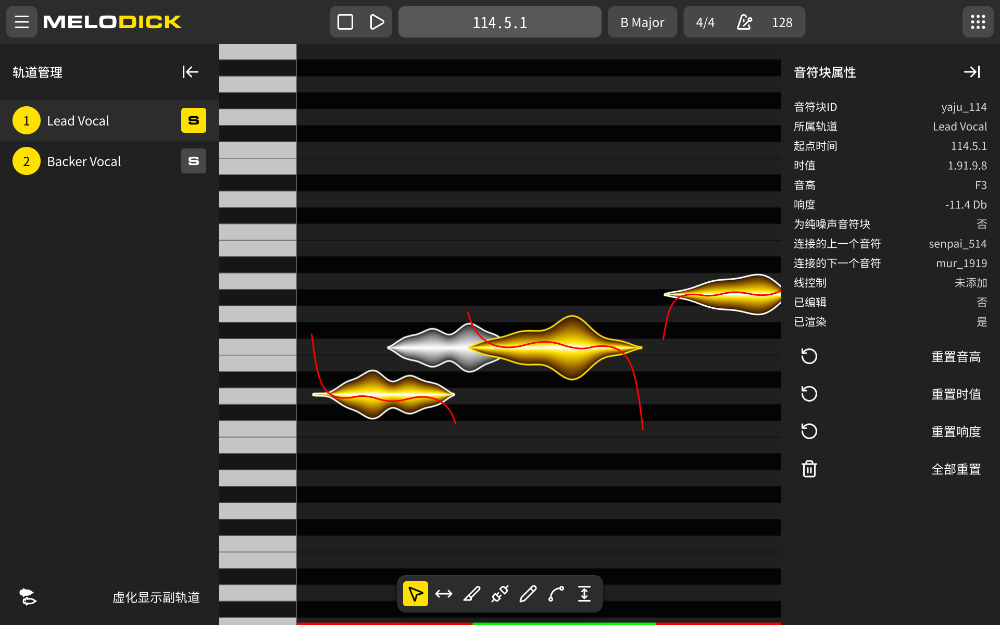

# Melodick UI Design Tokens 规范文档：初级版

预览图：

## 基础色彩
用于特定功能组件（如钢琴键、渲染状态）的原始色彩。

| Token 名         | 颜色值 (RGBA)         | 说明              |
|:----------------|:-------------------|:----------------|
| `white`         | `255, 255, 255, 1` | 绝对白             |
| `black`         | `0, 0, 0, 1`       | 绝对黑             |
| `keyboardWhite` | `197, 197, 197, 1` | 钢琴白键            |
| `keyboardBlack` | `22, 22, 22, 1`    | 钢琴黑键 / 深色背景基础   |
| `red`           | `255, 0, 0, 1`     | 警告、未渲染状态、音高曲线线稿 |
| `green`         | `0, 255, 0, 1`     | 完成、已渲染状态        |

## 暗色模式主题
致敬 Material Design 语意的典型工具软件风格。

| Token 名            | 颜色值 (RGBA)         | 说明                   |
|:-------------------|:-------------------|:---------------------|
| `primary`          | `255, 225, 0, 1`   | 品牌色（亮黄），用于焦点、选中、核心操作 |
| `onPrimary`        | `0, 0, 0, 1`       | 在品牌色之上的内容颜色          |
| `containerHighest` | `87, 87, 87, 1`    | 最高层级容器（如高亮的输入框背景）    |
| `containerHigh`    | `72, 72, 72, 1`    | 高层级容器（如普通按钮背景）       |
| `container`        | `44, 44, 44, 1`    | 标准层级容器（如悬浮工具栏、侧边栏背景） |
| `containerLow`     | `33, 33, 33, 1`    | 低层级容器（如面板背景、卡片底色）    |
| `outline`          | `96, 96, 96, 1`    | 描边、分割线、弱网格线          |
| `onSurface`        | `255, 255, 255, 1` | 主文字颜色、主图标颜色          |
| `onSurfaceVariant` | `217, 217, 217, 1` | 辅助文字、次要内容颜色          |

## 3. 排版系统
所有字体默认为黑体（即系统默认），若系统没有Mono，可能得捆个轻量级Noto Sans Mono进去。

| Token 名           | 字号     | 说明                     |
|:------------------|:-------|:-----------------------|
| `fontSizeDisplay` | `20px` | 顶部节拍、时间显示（加粗/Mono）     |
| `fontSizeTitle`   | `16px` | 面板标题、轨道名（Medium）       |
| `fontSizeButton`  | `16px` | 按钮文字（Regular）          |
| `fontSizeBody`    | `14px` | 属性面板正文、列表内容            |
| `fontSizeCaption` | `12px` | 辅助提示、极小标签（时间线上的时间揭示）文字 |

## 4. 间距与尺寸
采用 4px 乘数系统，确保界面节奏严丝合缝。

| Token 名               | 数值     | 说明                        |
|:----------------------|:-------|:--------------------------|
| `spacingExtraSmall`   | `4px`  | 极小间距（如胶囊内图标间距）            |
| `spacingSmall`        | `8px`  | 标准间距（Button Padding, Gap） |
| `spacingMiddle`       | `16px` | 面板内边距                     |
| `heightControlSmall`  | `32px` | 小型控件高度（悬浮工具栏的按钮）          |
| `heightControlMiddle` | `40px` | 标准控件高度（各个普通按钮）            |

## 5. 圆角
| Token 名        | 数值     | 说明               |
|:---------------|:-------|:-----------------|
| `radiusSmall`  | `4px`  | 小组件圆角（工具按钮）      |
| `radiusMiddle` | `8px`  | 中组件圆角（普通按钮、输入框）  |
| `radiusLarge`  | `12px` | 大组件/容器圆角（悬浮胶囊外框） |

## 6. 阴影效果
采用多层复合阴影，模拟真实物理深度。

| Token 名        | 阴影配方                                                                                                  | 说明                 |
|:---------------|:------------------------------------------------------------------------------------------------------|:-------------------|
| `shadowSmall`  | `0px 1px 3px rgba(0,0,0,0.4), 0px 4px 8px rgba(0,0,0,0.2)`                                            | 轻微悬浮（Tooltip）      |
| `shadowMiddle` | `0px 2px 6px rgba(0,0,0,0.5), 0px 8px 16px rgba(0,0,0,0.4), inset 0px 1px 0px rgba(255,255,255,0.08)` | 明确悬浮（工具条胶囊，含顶部轮廓光） |
| `shadowLarge`  | `0px 4px 12px rgba(0,0,0,0.6), 0px 16px 32px rgba(0,0,0,0.5), 0px 32px 64px rgba(0,0,0,0.4)`          | 顶层悬浮（模态弹窗）         |

---

## 7. 组件使用例

### A. 普通按钮
*   **背景色**: `containerHigh` (默认) / 透明 (Hover后显色)
*   **前景色**: `onSurface`
*   **高度**: `heightControlMiddle` (40px)
*   **圆角**: `radiusMiddle` (8px)
*   **间距**: 内边距及元素间距均引用 `spacingSmall` (8px)
*   **文字**: `fontSizeButton` (16px)
*   **图标采取**: `24px` 系列

### B. 底部悬浮工具胶囊 (Floating Tool Palette)
*   **容器背景**: `container`
*   **容器圆角**: `radiusLarge` (12px)
*   **容器内边距**: `spacingSmall` (8px)
*   **容器效果**: `shadowMiddle`
*   **按钮**: 高宽 `heightControlSmall` (32px), 圆角 `radiusSmall` (4px), 按钮间间距 `spacingExtraSmall` (4px)
*   **按钮选中态**: 背景 `primary`, 前景 `onPrimary`
*   **按钮未选中态**: 背景 `透明`, 前景 `onSurface`

### C. 属性列表项
*   **字体**: `fontSizeBody` (14px)
*   **左侧 Label 颜色**: `onSurface`
*   **右侧 Value 颜色**: `onSurfaceVariant`

### D. 时间指示器 (如：114.5.1)
*   **字体**: `fontSizeDisplay` (20px)
*   **容器背景**: `containerHighest`
*   **文字颜色**: `onSurface`